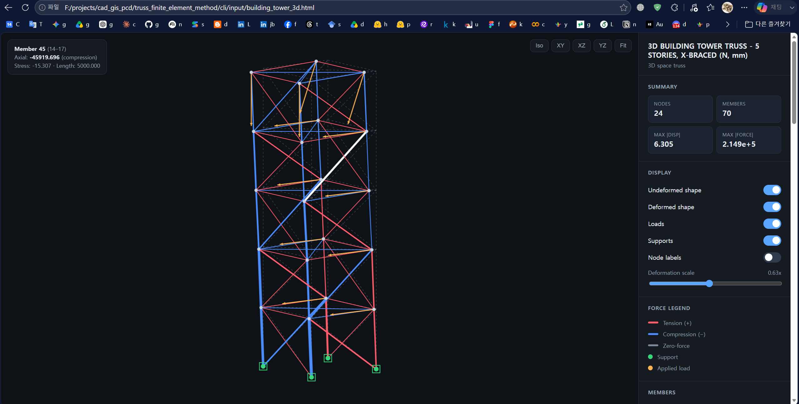
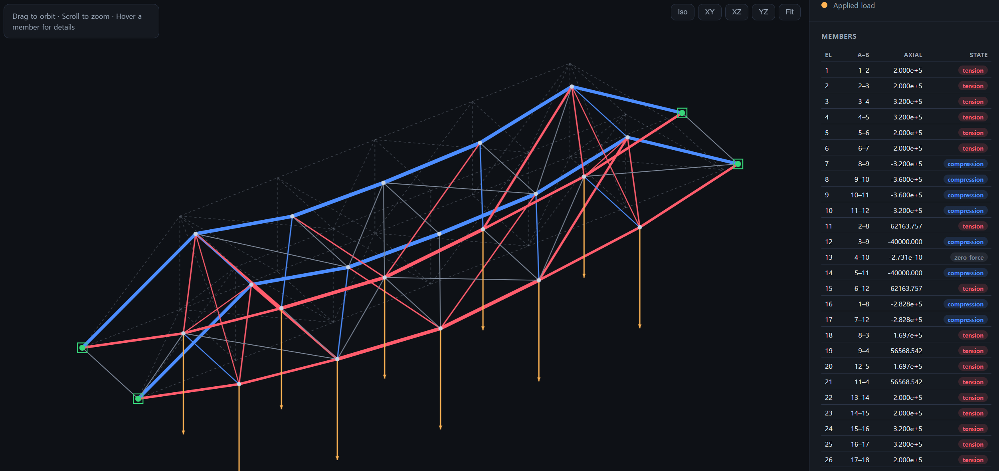
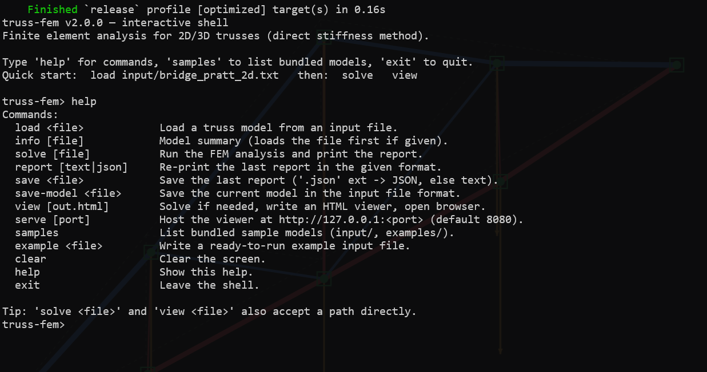

# Finite Element Method for Truss Analysis

Finite element analysis for **2D / 3D pin-jointed trusses** using the direct
stiffness method. It computes nodal displacements, support reactions, and member
axial forces/stresses, and renders the results in an interactive web-based 3D
viewer.

This repository contains two implementations:

- **`cli/`** — a modern **Rust command-line** version (recommended), rewritten
  from the original C++ code. It adds a full solver, an interactive shell, a
  variety of commands, text/JSON reports, and a self-contained **web 3D
  viewer**. See [`cli/README.md`](cli/README.md) for full details.
- **root `*.cpp/.h`** — the original **MFC C++** version from 2005, kept for
  reference. Its analysis engine was never finished.

## Version history

- **2.0, 2026** — Rust CLI rewrite of the legacy C++ program: complete
  direct-stiffness solver, interactive shell, web viewer, JSON export, unit
  tests, and several bug fixes over the original.
- **1.0, 2005.7.24** — initial MFC C++ version for researching FEM.

## Installation (Rust CLI)

1. Install a [Rust toolchain](https://rustup.rs) (1.70+).
2. Build the CLI:

```powershell
cd cli
cargo build --release
# binary: target/release/truss-fem(.exe)
```

The only external dependency is `clap` for argument parsing; the FEM engine,
JSON writer, web viewer, and HTTP server are implemented with the standard
library.

## Quick start

The easiest entry point is the launcher script, which builds the project and
drops you into the **interactive shell**:

```powershell
cd cli
.\run.bat            # Windows  (./run.sh on Linux/macOS/Git Bash)
```

```text
truss-fem> samples                          # list bundled models
truss-fem> load input/bridge_pratt_2d.txt   # load one
truss-fem> solve                            # run the analysis, print the report
truss-fem> view                             # open the interactive web viewer
truss-fem> save results.json                # save the report (text or JSON)
truss-fem> exit
```

Or use the one-shot commands directly:

```powershell
./target/release/truss-fem example my_truss.txt        # write an example model
./target/release/truss-fem solve   my_truss.txt        # analyze, print report
./target/release/truss-fem view    my_truss.txt --open # open the 3D web viewer
```

## Commands

| Command   | Description                                                        |
|-----------|--------------------------------------------------------------------|
| `shell`   | Start the interactive shell (default when no subcommand is given). |
| `solve`   | Analyze a model; print/save a report (`--format text\|json`).      |
| `view`    | Generate a self-contained interactive HTML viewer (`--open`).      |
| `serve`   | Host the viewer from a local web server and open the browser.      |
| `info`    | Print a model summary (nodes, elements, supports, DOFs).           |
| `example` | Write a ready-to-run example input file.                           |

Run `truss-fem <command> --help` for all options. The interactive shell offers
the same features (`load`, `info`, `solve`, `report`, `save`, `save-model`,
`view`, `serve`, `samples`, `example`, `help`, `exit`) while keeping the current
model in memory.

Ready-to-run sample models (bridges, roof, building tower, transmission tower)
are bundled under [`cli/input/`](cli/input) and [`cli/examples/`](cli/examples).

## Web viewer

The viewer is a single, dependency-free HTML file (no CDN, works offline). It
shows the input truss geometry and the analysis results together:

- **3D orbit view** — drag to rotate, scroll to zoom, `Shift`+drag to pan.
- **Undeformed vs. deformed** shape overlay with an adjustable deformation scale.
- **Members colored by axial force** — red = tension, blue = compression,
  thickness scaled by magnitude; hover any member for its force/stress.
- **Supports and loads** drawn as markers and arrows.
- Sortable summary, member, and displacement tables.
- Preset views (Iso / XY / XZ / YZ) and one-click Fit.





## Input data

Edit an input file like the one below (backward-compatible with the legacy
`TrustInput.txt`). See [`cli/README.md`](cli/README.md#input-format) for the
full field description.

```text
SPACE TRUSS EXAMPLE OF SECTION
3,4
1,0,1,0,72.0,0.,0.,0.,0.,-1000.0
2,1,1,1,0.0,36.0,0.,0.,0.,0.
3,1,1,1,0.0,36.0,72.0,0.,0.,0.
4,1,1,1,0.0,0.0,-48.0,0.,0.,0.
1,1,4,1.2E+6,0.187
2,1,2,1.2E+6,0.302
3,1,3,1.2E+6,0.726
```

Line 2 is `<numElements>,<numNodes>`. Each node line is
`id, fixX, fixY, fixZ, x, y, z, Fx, Fy, Fz` (fix = 1 means a support). Each
element line is `id, nodeA, nodeB, E, A`.

## Legacy MFC version (1.0)

1. Install Visual Studio.
2. Build using the `CauFEM.dsw` / `CauFEM.dsp` project files.

> Note: the original engine's solver was left as empty stubs, so the 1.0 GUI
> loads a model but does not produce results. Use the Rust CLI in `cli/` for
> actual analysis.

## Developer

Kang Taewook, Ph.D. — laputa99999@gmail.com

## License

MIT license
